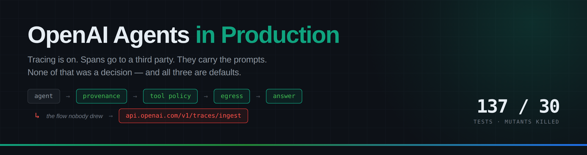

<div align="center">

# OpenAI Agents in Production

### The parts of an OpenAI Agents SDK deployment that have to be right whether or not the agent is — starting with the three defaults that ship your customers' prompts to a third party before you have written a second file.

[](LICENSE)
[](pyproject.toml)
[](tests/)
[](src/agent_service/)

**[What the defaults do](docs/01-what-the-defaults-do.md) · [Guardrails](docs/02-guardrails.md) · [Sessions & tenancy](docs/03-sessions-and-tenancy.md) · [Observability](docs/04-observability.md) · [Deployment](docs/05-deployment.md)**

</div>

---

## The finding

Six lines from the SDK quickstart, and three things are true that nobody chose:

```python
from agents import Agent, Runner

agent = Agent(name="Assistant", instructions="You are a helpful assistant")
result = Runner.run_sync(agent, "Summarise this customer email: ...")
```

| | Default | Consequence |
|---|---|---|
| `RunConfig.tracing_disabled` | `False` | tracing is **on** |
| default span exporter | installed | spans POST to `api.openai.com/v1/traces/ingest`, using `OPENAI_API_KEY` |
| `trace_include_sensitive_data` | `True` | those spans carry prompts, completions and tool arguments |

A second data flow, carrying the conversation, to a third party, that is not
on your architecture diagram — because nobody drew it.

**And then the part that catches careful people:**

```
OPENAI_AGENTS_DONT_LOG_MODEL_DATA   default True    ← local logs redacted
trace_include_sensitive_data        default True    ← remote export verbose
```

The `DONT_LOG_*` flags govern the SDK's Python logger. They do not touch the
exporter. So the shipped posture is **strict on the data that never leaves
the process, permissive on the data that leaves it** — and an engineer who
reads "don't log model data: true" and stops has drawn a correct inference
from a misleading pair of names.

None of this is hidden or a vulnerability. It is all documented for anyone
who goes looking. Nobody goes looking at defaults, because a default reads
as a decision somebody already made on your behalf.

Every claim above is pinned by a test against the installed package, not
quoted from documentation. Verified against **`openai-agents` 0.22.0**.

---

## Quickstart

```bash
git clone https://github.com/sdaluga/openai-agents-in-production.git
cd openai-agents-in-production
pip install -e ".[dev]"

python examples/01-audit-your-defaults/audit_defaults.py   # what you ship by default
python examples/02-guardrails/run_guardrails.py            # the tripwire misses; the refund doesn't happen
python examples/03-sessions/tenant_isolation.py            # two customers, one conversation id
python examples/04-the-service/triage_service.py           # the whole thing, assembled

pytest                    # 137 tests, ~2s
python tools/mutate.py    # break all 30 controls, watch the suite go red
```

**No API key. No network.** One example has a `--live` flag that calls a
model, and nothing in the argument depends on running it.

That is not a limitation, it is the design: the layers that fail silently —
where your data goes, what your tools accept, whose conversation you just
loaded, what your traces contain — are all decidable without inference,
which is what makes them cheap enough to test properly.

---

## The four examples

### 🔍 [01 · Audit your defaults](examples/01-audit-your-defaults/)

Three configurations. **The middle one is the point:**

| | | |
|---|---|---|
| 1 · `RunConfig()` | the quickstart | 2 blocking |
| 2 · the one that looks handled | logging flags set, workflow named, traces grouped by tenant | **2 blocking** |
| 3 · hardened | processor you own, no payloads | clean |

Configuration 2 is not careless. Every individual thing that engineer did
was correct. It exports the same prompts as configuration 1.

### 🛡 [02 · Guardrails](examples/02-guardrails/)

Four support emails through three checks:

```
2 · The obvious injection
  tripwire   TRIPPED   policy  REFUSED  tool:revoked-while-suspicious

3 · The user changes their mind
  tripwire   clean     policy  allowed

4 · The injection the tripwire misses
  tripwire   clean     policy  REFUSED  tool:argument-rejected
```

Case 3 is why provenance matters — the sentence that trips inside an email
body is benign from a user, who is allowed to change their mind. Case 4 is
the argument: no override phrasing, no role reassignment, just a polite
sentence that happens to be an instruction. The tripwire finds nothing,
correctly. The $9,000 refund is refused anyway by a bound on `amount_cents`
that never read the email.

> **Filtering prompts scales with how clever the attacker is.
> Bounding what a tool will accept does not.**

### 🔑 [03 · Sessions and tenancy](examples/03-sessions/)

One optional argument, two entirely different bugs:

```
SQLiteSession("1")                  → worker 2 sees: []
SQLiteSession("1", db_path=...)     → globex sees: ['acme: our Q3 target is Northwind']
```

Without `db_path` you get amnesia across replicas, which presents as "the
agent keeps forgetting" and gets diagnosed as a model problem. With it you
get sharing — which production needs — and the client-supplied session id
becomes the entire authorisation model.

Also: what `limit` means (`['turn 6','turn 7','turn 8']` vs a store that
returns turns 1–3 forever, silently), path traversal in a conversation id,
and why retention has to be enforced on read.

### ⚙️ [04 · The service](examples/04-the-service/)

Everything assembled, running without an API key up to the moment the model
would be called. Both tenants send conversation id `t-5512`; nothing in the
handler had to remember to keep them apart.

---

## Ten things that surprise people

1. **Tracing is on, and it exports to OpenAI with your production API key.** That is a second data flow, and it is not on the diagram.
2. **`DONT_LOG_MODEL_DATA` doesn't touch the exporter.** Local logs are stricter than the remote export, out of the box.
3. **`OPENAI_AGENTS_DISABLE_TRACING=yes` does not disable tracing.** Only `true` and `1`. No warning.
4. **That variable is read once and cached for the process.** You cannot flip it mid-incident.
5. **`set_trace_processors` replaces; `add_trace_processor` appends.** Use the wrong one and the copy to OpenAI quietly continues.
6. **`trace_metadata` is exported regardless of `trace_include_sensitive_data`.** That flag governs payloads, not what you attached yourself.
7. **`store=None` isn't `store=False`.** The parameter is omitted and the API's default decides — a default that is not in your repository.
8. **`get_items(limit=N)` means the *latest* N.** Return the first N and your agent has a perfect memory of turn one, forever.
9. **`agents.Session` needs a `session_settings` attribute.** All four methods implemented, `isinstance` still False, no error anywhere.
10. **Nothing bounds a conversation's growth.** No TTL, no cap, no eviction — until the context call fails or the invoice does.

---

## The tests are the argument

```bash
pytest                    # 137 tests, ~2 seconds, no API key, no network
python tools/mutate.py    # 30 controls broken one at a time
```

Every test is named for the production incident it prevents, because a test
called `test_audit_works` tells a future reader nothing about whether it is
safe to delete.

**All 30 controls were mutation-checked** — deliberately broken, one at a
time, on a temporary copy of the tree, to confirm the suite goes red:

| Control broken | Tests that fail |
|---|---|
| The default-exporter finding removed | 4 |
| Payload exposure no longer reported | 2 |
| Env parsing back to one permissive parser | 2 |
| An unreadable config treated as safe | 2 |
| `store=None` stops being reported | 1 |
| PII in trace metadata downgraded to a warning | 1 |
| Blind spots stop being printed | 1 |
| Redaction rules stop being ordered by specificity | 4 |
| Values not normalised before hashing | 1 |
| Deep structures fall through instead of failing closed | 1 |
| An unconfigured redaction key becomes a constant | 1 |
| The tripwire scans every segment, not just untrusted | 2 |
| The tool allowlist removed | 2 |
| A missing argument skips its own check | 1 |
| Unparseable tool arguments allowed through | 1 |
| A raising predicate counts as a pass | 1 |
| Privilege not downgraded on suspicion | 1 |
| Egress evidence quotes the secret it found | 1 |
| A limit returns the first items instead of the latest | 1 |
| A limit of zero returns everything | 1 |
| The sanitiser drops its collision suffix | 1 |
| The tenant leaves the storage key | 4 |
| Retention not enforced on read | 4 |
| Stored items not copied | 2 |
| The `session_settings` attribute dropped | 1 |
| The trace processor stops swallowing exceptions | 3 |
| Trace payloads included by default | 3 |
| Trace errors no longer redacted | 1 |
| Dropped payloads leave no trace of their shape | 2 |
| Trace failures stop being counted | 3 |

The runner reports **STALE** when a mutant's target text no longer exists
and **INVALID** when an edit breaks import rather than failing a test. Both
are failures. A mutation suite that quietly stops mutating is the same
failure mode it exists to catch — and the first version of this script
reported 30/30 while several mutants had never reached a test.

### Three bugs this discipline found in this repository

- **One permissive environment parser for three different SDK parsers.** The
  audit would have reported `DISABLE_TRACING=yes` as *disabled* while
  tracing ran — clearing the exact configuration it exists to catch.
- **`ScopedSession` failed `isinstance(x, agents.Session)`.** All four
  methods, missing one attribute. Found by a test asserting the thing this
  repository warns others about.
- **Example 03 claimed a leak that does not happen.** The example's own
  self-check caught it. The section is better for showing both failure modes.

---

## Layout

```
src/agent_service/
├── posture.py        the egress audit · findings, remedies, blind spots    24 tests
├── redaction.py      stable, non-reversible, in-flight                     26 tests
├── guardrails.py     provenance · tool policy · egress                     26 tests
├── session_store.py  tenant-scoped Session + retention                     20 tests
├── tracing.py        a TracingProcessor that keeps spans in your estate     16 tests
└── service.py        the only module that imports the SDK                  10 tests

tests/test_sdk_contract.py    every claim about the SDK, pinned            15 tests
tools/mutate.py               break each control, confirm the suite notices

examples/
├── 01-audit-your-defaults/   three configurations              no API key
├── 02-guardrails/            four emails, three checks         no API key
├── 03-sessions/              two customers, one id             no API key
└── 04-the-service/           assembled                         no API key (--live optional)

docs/  01 defaults · 02 guardrails · 03 sessions · 04 observability · 05 deployment
```

The toolkit has **no runtime dependencies**. That is a constraint, not an
accident of scope: it means the audit, the guardrail logic, the session
store and the trace processor run in a pre-commit hook, a CI job, or a
service that has not installed the SDK. A governance control you can only
run inside the thing it governs is a control that gets skipped.

---

## Where this stops

- **This does not detect prompt injection**, and says so in its tests. The tripwire catches the unsophisticated majority. The control is the tool policy, which does not care whether the model was persuaded.
- **The redactor misses names, addresses and account references** — anything that is PII because of what it means rather than what it looks like. That needs a real NER or DLP pass (Purview, Macie, Cloud DLP). This is where you hand off to one.
- **The posture audit reads three objects.** It cannot see your account's retention setting, your egress rules, or what your tools do. Those are printed as blind spots with every report, because a tool that returns `COMPLIANT` is a liability in a review.
- **No backend implementations ship.** Postgres, DynamoDB and Redis are mapped in the docs in a few lines each. A reference Postgres client would be subtly wrong about your connection pooling and would be copied anyway.
- **This is not compliance advice.** It produces the artifacts your control framework needs, cheaply enough that nobody skips them.

---

## Related

[**claude-cowork-playbook**](https://github.com/sdaluga/claude-cowork-playbook) — the same questions asked of the Claude Agent SDK, where the shape of the answer is different because the runtime is a subprocess rather than a client library.

[**fine-tuning-honestly**](https://github.com/sdaluga/fine-tuning-honestly) — the layer underneath: whether to change weights at all, and what has to be true before you do.

## Contributing

Issues and PRs welcome — especially SDK behaviours this gets wrong,
additional posture findings, and redaction shapes that leak in practice.
Bring tests: every existing one is named for the mistake it prevents, and
new controls should be mutation-checked the same way. See
[CONTRIBUTING.md](CONTRIBUTING.md).

## License

MIT — see [LICENSE](LICENSE).
